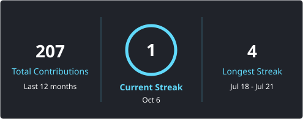

<h1 align="center">
  
</h1>

<h5 align="center">
  <code><a href="https://www.linkedin.com/in/yashwanth-s-75b33938b" title="LinkedIn Profile">💼 LinkedIn</a></code>
  <code><a href="mailto:yashwanthsoff@gmail.com" title="Email">✉️ Email</a></code>
</h5>
 

  Hi, I'm Yashwanth S, Backend Developer &amp; Cloud Engineering Enthusiast &amp; AI Application Developer from Bengaluru, India
   
   
  🎓 I'm pursuing BE in Computer Science &amp; Engineering at BMS Institute of Technology &amp; Management (BMSIT&amp;M)
   
  ☁️ I build cloud-native backends and AI applications, and I'm working towards becoming a Cloud Architect
   
   I compete in hackathons: AMD Slingshot, IBM SkillsBuild AI Builders, AWS × CockroachDB Agentic Memory, Bengaluru Tech Week 2k26, First Commit 2k26, Kognivera 2k26 and more
   
  🌐 I contribute to open source
   
  💻 I love building scalable systems and learning everything about them
   
  💬 Ask me anything from <a href="https://github.com/yashwanthsoff-cmyk/yashwanthsoff-cmyk/issues" title="Issues">Here</a>
   
  📫 How to reach me: <a href="mailto:yashwanthsoff@gmail.com">yashwanthsoff@gmail.com</a>

<h2 align="center">🔥 Languages &amp; Frameworks &amp; Tools &amp; Abilities 🔥</h2>
 

  <code></code>
  <code></code>
  <code></code>
  <code></code>
  <code></code>
  <code></code>
  <code></code>
  <code></code>
  <code></code>
  <code></code>
  <code></code>
  <code></code>
  <code></code>
  <code></code>
  <code></code>
  <code></code>

<h2 align="center">🚀 Featured Projects 🚀</h2>
 
<table align="center">
  <tr>
    <td width="33%" valign="top">
      <h3 align="center">🪳 Roach Watch</h3>
      
<i>AWS × CockroachDB Agentic Memory Challenge</i>

      Autonomous incident-response engine. Retrieves similar past incidents, generates evidence-grounded root-cause analysis, and re-checks whether its own earlier advice held up. Application state and vector memory live together in CockroachDB.
        
      <b>Stack:</b> CockroachDB · AWS S3 · Vercel · Render and more
        
      

        <a href="https://incident-guardian.vercel.app/">Live</a> ·
        <a href="https://github.com/yashwanthsoff-cmyk/awsXcockroach-roachwatch-incident-guardian-frontend">Frontend</a> ·
        <a href="https://github.com/yashwanthsoff-cmyk/awsXcockroach-roach-watch-backend">Backend</a> ·
        <a href="https://www.youtube.com/watch?v=zqW0JNkkIUY">Video</a>
      

    </td>
    <td width="33%" valign="top">
      <h3 align="center">🏎️ RaceIQ</h3>
      
<i>IBM SkillsBuild AI Builders Challenge</i>

      AI co-pilot for Formula 1 race engineers. Analyses live OpenF1 telemetry, tyre degradation and rival pit windows, and gives explainable strategy recommendations using IBM Granite and Docling.
        
      <b>Stack:</b> React · TanStack Start · AWS Lambda · Supabase · Cloudflare Workers and more
        
      

        <a href="https://tanstack-start-app.raceibm-iq.workers.dev">Live</a> ·
        <a href="https://github.com/yashwanthsoff-cmyk/Race-IQ-IBM">Code</a>
      

    </td>
    <td width="33%" valign="top">
      <h3 align="center">🧭 BengTeck26</h3>
      
<i>Bengaluru Tech Week 26 · Checkpoint-Native DX</i>

      Developer-experience toolkit with five modules: dead-end registry, requirement ledger, intent conformance, agent resume contract, and resume integrity check with agent memory.
        
      <b>Stack:</b> Python · Streamlit · Supabase · Databricks and more
        
      

        <a href="https://github.com/yashwanthsoff-cmyk/BengTeck26">Code</a>
      

    </td>
  </tr>
</table>
 

  
   
  ▶ Roach Watch demo

<h2 align="center">⚡ Stats ⚡</h2>
 
<table align="center">
  <tr>
    <td align="center">
      
    </td>
    <td align="center">
      
    </td>
  </tr>
  <tr>
    <td colspan="2" align="center">
      
    </td>
  </tr>
</table>

<h2 align="center">👨‍💻 Repositories 👨‍💻</h2>
 
<table align="center">
  <tr>
    <td align="center">
      
    </td>
    <td align="center">
      
    </td>
  </tr>
  <tr>
    <td align="center">
      
    </td>
    <td align="center">
      
    </td>
  </tr>
</table>
 

<h4 align="center">
  <a href="https://github.com/yashwanthsoff-cmyk?tab=repositories" title="Show Repositories">🔎 Show More 🔍</a>
</h4>
